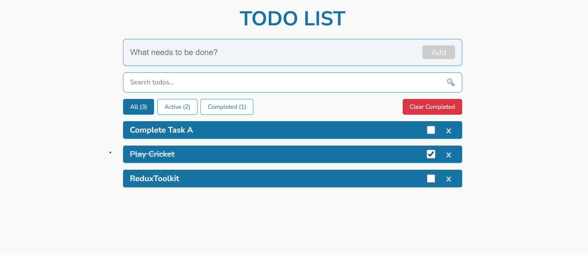

## Professional Todo App

A modern Todo application built with React and Redux Toolkit featuring search, filtering, and local storage.

https://img.shields.io/badge/React-18.2.0-blue
https://img.shields.io/badge/Redux_Toolkit-1.9.7-purple
https://img.shields.io/badge/Vite-4.4.5-yellow

## 🌐 Live Demo

**Live Application:** [https://professionl-todo-app.netlify.app](https://professionl-todo-app.netlify.app)

## 📸 Screenshots

## ✨ Features

✅ Add, delete, and toggle todos

🔍 Search and filter (All/Active/Completed)

💾 Local storage persistence

🎨 Professional UI with loading states

📱 Fully responsive design

## Quick Start

git clone https://github.com/saifullahmsd/professional-todo-app.git

cd professional-todo-app

npm install

npm run dev

Visit http://localhost:3000 to view the app.

## Tech Stack

Frontend: React 18

State Management: Redux Toolkit

Build Tool: Vite

Styling: CSS3

Storage: LocalStorage

## 📁 Project Structure

src/
├── components/ # React components
├── store/ # Redux store, slices, middleware
├── styles/ # CSS files
└── App.jsx Main App component
└── main.jsx # Entry point

## 🎯 Usage

Add Todo: Type and press Enter or click Add

Complete: Click the checkbox

Delete: Click the × button

Search: Use search bar to filter todos

Filter: Switch between All, Active, Completed views

## 🤝 Contributing

Contributions are welcome! Please feel free to submit a Pull Request.

## 📝 License

This project is licensed under the MIT License.

Built with ❤️ using React and Redux Toolkit
